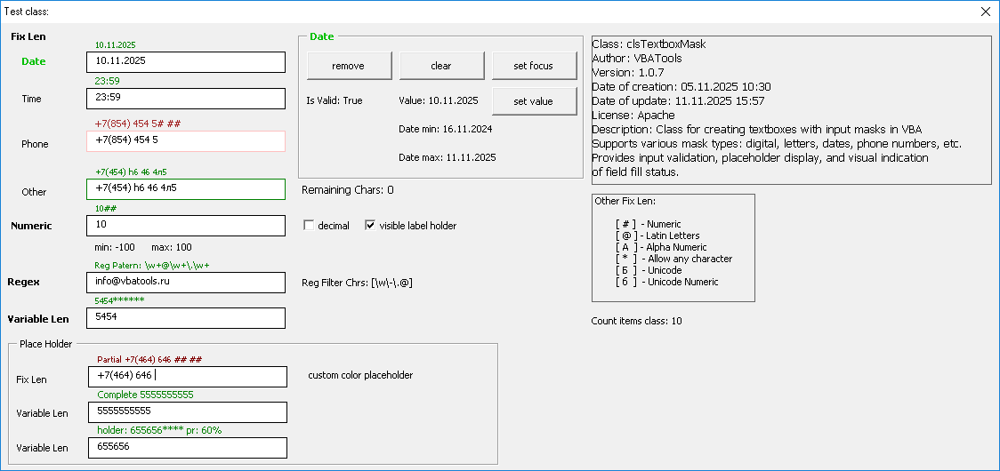

# VBA TextBox Masks Class

**clsTextboxMask** - это мощный класс для VBA, который позволяет создавать текстовые поля с масками ввода в Excel и других приложениях Office. Он обеспечивает валидацию ввода, отображение плейсхолдеров и визуальное указание статуса заполнения поля.

## Скриншоты



## Основные возможности

- Поддержка различных типов масок ввода (цифры, даты, время, текст, регулярные выражения)
- Валидация ввода в реальном времени
- Отображение плейсхолдеров с различными статусами (пустое, частично заполненное, полностью заполненное, неверное)
- Визуальная индикация корректности ввода через цвет границы
- Поддержка числовых значений с ограничениями по диапазону, знаку и наличию десятичных знаков
- Поддержка переменной длины текста
- Поддержка валидации через регулярные выражения
- Поддержка настройки цвета плейсхолдера в зависимости от статуса поля
- Поддержка шаблонов плейсхолдера с маркерами: {mask}, {filled}, {remaining}, {holder}, {RegexPattern}, {RegexFilter}, {percent}

## Установка

1. Скопируйте файл `clsTextboxMask.cls` в ваш проект VBA
2. Используйте класс в ваших UserForms

## Основные свойства

| Свойство | Тип | Описание |
|----------|-----|----------|
| `TextBox` | MSForms.TextBox | Ссылка на текстовое поле, к которому применяется маска |
| `LabelPlaceholder` | MSForms.Label | Ссылка на метку плейсхолдера, которая отображает подсказки |
| `Mask` | String | Маска ввода, определяющая допустимые символы |
| `Value` | String | Текущее значение текстового поля |
| `CurrentMaskType` | enumTypeMask | Тип текущей маски |
| `Min` | Single | Минимальное значение для числовых полей |
| `Max` | Single | Максимальное значение для числовых полей |
| `IsNegative` | Boolean | Разрешены ли отрицательные значения |
| `IsDecemal` | Boolean | Разрешены ли десятичные значения |
| `BorderColorValid` | Long | Цвет границы при корректном вводе |
| `BorderColorInvalid` | Long | Цвет границы при некорректном вводе |
| `PlaceholderEmptyColor` | Long | Цвет текста плейсхолдера для пустого поля |
| `PlaceholderPartialColor` | Long | Цвет текста плейсхолдера для частично заполненного поля |
| `PlaceholderCompleteColor` | Long | Цвет текста плейсхолдера для полностью заполненного поля |
| `PlaceholderInvalidColor` | Long | Цвет текста плейсхолдера для поля с некорректными данными |
| `PlaceholderEmpty` | String | Текст плейсхолдера для пустого поля |
| `PlaceholderPartial` | String | Текст плейсхолдера для частично заполненного поля |
| `PlaceholderComplete` | String | Текст плейсхолдера для полностью заполненного поля |
| `PlaceholderInvalid` | String | Текст плейсхолдера для поля с некорректными данными |

## Типы масок

Класс поддерживает следующие типы масок:

| Тип маски | Значение | Описание |
|-----------|----------|----------|
| `tOtherFix` | 1 | Фиксированная маска с различными символами |
| `tDateFix` | 2 | Фиксированная маска для дат |
| `tTimeFix` | 3 | Фиксированная маска для времени |
| `tNumeric` | 4 | Числовая маска с возможностью ограничения диапазона |
| `tVariableLen` | 5 | Маска с переменной длиной |
| `tRegex` | 6 | Маска на основе регулярных выражений |

## Основные методы

### `AddFieldNumeric`
Добавляет числовое поле с заданными параметрами валидации.

```vba
Dim numField As New clsTextboxMask
Call numField.AddFieldNumeric(inputTextBox:=Me.TextBox1, _
                             minValue:=0, _
                             maxValue:=100, _
                             allowDecimal:=True, _
                             allowNegative:=False)
```

**Параметры:**
- `inputTextBox` - текстовое поле, к которому применяется маска
- `minValue` - минимальное допустимое значение
- `maxValue` - максимальное допустимое значение
- `allowDecimal` - разрешение на ввод десятичных значений
- `allowNegative` - разрешение на ввод отрицательных значений
- `showPlaceholder` - отображение плейсхолдера (опционально)
- `numberFormat` - формат отображения числа (опционально)
- `BorderColorValid` - цвет границы при корректном вводе (опционально)
- `BorderColorInvalid` - цвет границы при некорректном вводе (опционально)
- `PlaceholderColor` - цвет плейсхолдера (опционально)
- `PlaceholderEmpty` - текст плейсхолдера для пустого поля (опционально)
- `PlaceholderPartial` - текст плейсхолдера для частично заполненного поля (опционально)
- `PlaceholderComplete` - текст плейсхолдера для полностью заполненного поля (опционально)
- `PlaceholderInvalid` - текст плейсхолдера для поля с некорректными данными (опционально)
- `PlaceHolderTemplete` - шаблон плейсхолдера (опционально)

### `AddFieldDate`
Добавляет поле ввода даты с заданными параметрами валидации.

```vba
Dim dateField As New clsTextboxMask
Call dateField.AddFieldDate(inputTextBox:=Me.TextBox2, _
                           dateMask:="##.##.####", _
                           minDate:=#1/1/2020#, _
                           maxDate:=#12/31/2030#, _
                           dateFormat:="dd.mm.yyyy")
```

**Параметры:**
- `inputTextBox` - текстовое поле, к которому применяется маска
- `dateMask` - маска ввода даты
- `minDate` - минимальная допустимая дата
- `maxDate` - максимальная допустимая дата
- `dateFormat` - формат отображения даты (опционально)
- `showPlaceholder` - отображение плейсхолдера (опционально)
- `BorderColorValid` - цвет границы при корректном вводе (опционально)
- `BorderColorInvalid` - цвет границы при некорректном вводе (опционально)
- `PlaceholderColor` - цвет плейсхолдера (опционально)
- `PlaceholderEmpty` - текст плейсхолдера для пустого поля (опционально)
- `PlaceholderPartial` - текст плейсхолдера для частично заполненного поля (опционально)
- `PlaceholderComplete` - текст плейсхолдера для полностью заполненного поля (опционально)
- `PlaceholderInvalid` - текст плейсхолдера для поля с некорректными данными (опционально)
- `PlaceHolderTemplete` - шаблон плейсхолдера (опционально)

### `AddFieldTime`
Добавляет поле ввода времени с заданными параметрами валидации.

```vba
Dim timeField As New clsTextboxMask
Call timeField.AddFieldTime(inputTextBox:=Me.TextBox3, _
                           timeMask:="##:##", _
                           minTime:=#0:00:00#, _
                           maxTime:=#23:59#, _
                           timeFormat:="hh:mm")
```

**Параметры:**
- `inputTextBox` - текстовое поле, к которому применяется маска
- `timeMask` - маска ввода времени
- `minTime` - минимальное допустимое время
- `maxTime` - максимальное допустимое время
- `timeFormat` - формат отображения времени (опционально)
- `showPlaceholder` - отображение плейсхолдера (опционально)
- `BorderColorValid` - цвет границы при корректном вводе (опционально)
- `BorderColorInvalid` - цвет границы при некорректном вводе (опционально)
- `PlaceholderColor` - цвет плейсхолдера (опционально)
- `PlaceholderEmpty` - текст плейсхолдера для пустого поля (опционально)
- `PlaceholderPartial` - текст плейсхолдера для частично заполненного поля (опционально)
- `PlaceholderComplete` - текст плейсхолдера для полностью заполненного поля (опционально)
- `PlaceholderInvalid` - текст плейсхолдера для поля с некорректными данными (опционально)
- `PlaceHolderTemplete` - шаблон плейсхолдера (опционально)

### `AddFieldText`
Добавляет текстовое поле с заданной маской ввода.

```vba
Dim textField As New clsTextboxMask
Call textField.AddFieldText(inputTextBox:=Me.TextBox4, _
                           textMask:="+7(*##) @# A# #Б#")  ' Буквы-цифры
```

**Параметры:**
- `inputTextBox` - текстовое поле, к которому применяется маска
- `textMask` - маска ввода текста
- `showPlaceholder` - отображение плейсхолдера (опционально)
- `BorderColorValid` - цвет границы при корректном вводе (опционально)
- `BorderColorInvalid` - цвет границы при некорректном вводе (опционально)
- `PlaceholderColor` - цвет плейсхолдера (опционально)
- `PlaceholderEmpty` - текст плейсхолдера для пустого поля (опционально)
- `PlaceholderPartial` - текст плейсхолдера для частично заполненного поля (опционально)
- `PlaceholderComplete` - текст плейсхолдера для полностью заполненного поля (опционально)
- `PlaceholderInvalid` - текст плейсхолдера для поля с некорректными данными (опционально)
- `PlaceHolderTemplete` - шаблон плейсхолдера (опционально)

### `AddFieldVariableLength`
Добавляет поле с переменной длиной текста.

```vba
Dim varField As New clsTextboxMask
Call varField.AddFieldVariableLength(inputTextBox:=Me.TextBox5, _
                                    maxLength:=10, _
                                    textMask:="##")
```

**Параметры:**
- `inputTextBox` - текстовое поле, к которому применяется маска
- `maxLength` - максимальная длина текста
- `textMask` - маска ввода текста (опционально)
- `showPlaceholder` - отображение плейсхолдера (опционально)
- `BorderColorValid` - цвет границы при корректном вводе (опционально)
- `BorderColorInvalid` - цвет границы при некорректном вводе (опционально)
- `PlaceholderColor` - цвет плейсхолдера (опционально)
- `PlaceholderEmpty` - текст плейсхолдера для пустого поля (опционально)
- `PlaceholderPartial` - текст плейсхолдера для частично заполненного поля (опционально)
- `PlaceholderComplete` - текст плейсхолдера для полностью заполненного поля (опционально)
- `PlaceholderInvalid` - текст плейсхолдера для поля с некорректными данными (опционально)
- `PlaceHolderTemplete` - шаблон плейсхолдера (опционально)

### `AddFieldRegex`
Добавляет поле с валидацией через регулярное выражение.

```vba
Dim regexField As New clsTextboxMask
Call regexField.AddFieldRegex(inputTextBox:=Me.TextBox6, _
                             RegexPattern:="^[A-Z]{2}\d{4}$", _
                             RegexFilter:="[A-Z0-9]")
```

**Параметры:**
- `inputTextBox` - текстовое поле, к которому применяется маска
- `RegexPattern` - паттерн регулярного выражения для валидации
- `RegexFilter` - фильтр регулярного выражения
- `showPlaceholder` - отображение плейсхолдера (опционально)
- `BorderColorValid` - цвет границы при корректном вводе (опционально)
- `BorderColorInvalid` - цвет границы при некорректном вводе (опционально)
- `PlaceholderColor` - цвет плейсхолдера (опционально)
- `PlaceholderEmpty` - текст плейсхолдера для пустого поля (опционально)
- `PlaceholderPartial` - текст плейсхолдера для частично заполненного поля (опционально)
- `PlaceholderComplete` - текст плейсхолдера для полностью заполненного поля (опционально)
- `PlaceholderInvalid` - текст плейсхолдера для поля с некорректными данными (опционально)
- `PlaceHolderTemplete` - шаблон плейсхолдера (опционально)

### `IsValid`
Проверяет корректность введенных данных в текстовом поле.

```vba
If myField.IsValid() Then
    MsgBox "Данные корректны!"
Else
    MsgBox "Данные некорректны!"
End If
```

### `Clear`
Очищает текстовое поле.

```vba
myField.Clear()
```

### `SetFocus`
Устанавливает фокус на текстовое поле.

```vba
myField.SetFocus()
```

### `RemoveItem`
Удаляет элемент маски текстового поля и связанные с ним компоненты.

```vba
myField.RemoveItem()
```

## Символы маски

При создании текстовых масок используются следующие символы:

| Символ | Описание |
|--------|----------|
| `#` | Цифры (0-9) |
| `@` | Латинские буквы (A-Z, a-z) |
| `A` | Латинские буквы и цифры (A-Z, a-z, 0-9) |
| `Б` | Кирилические буквы |
| `б` | Кириллические буквы и цифры |
| `*` | Любые символы |

## Примеры использования

### 1. Числовое поле с ограничениями:
```vba
Dim numField As New clsTextboxMask
Call numField.AddFieldNumeric(inputTextBox:=Me.TextBox1, _
                             minValue:=0, _
                             maxValue:=100, _
                             allowDecimal:=True, _
                             allowNegative:=False)
```

### 2. Поле даты:
```vba
Dim dateField As New clsTextboxMask
Call dateField.AddFieldDate(inputTextBox:=Me.TextBox2, _
                           dateMask:="##.##.####", _
                           minDate:=#1/1/2020#, _
                           maxDate:=#12/31/2030#, _
                           dateFormat:="dd.mm.yyyy")
```

### 3. Текстовое поле с маской:
```vba
Dim textField As New clsTextboxMask
Call textField.AddFieldText(inputTextBox:=Me.TextBox3, _
                           textMask:="+7(*##) @# A# #Б#")  ' Буквы-цифры
```

## Зависимости

- MSForms.TextBox
- MSForms.Label
- VBScript.RegExp (для валидации через регулярные выражения)

## Лицензия

Проект лицензирован под Apache License 2.0 - смотри файл [LICENSE](LICENSE) для подробностей.